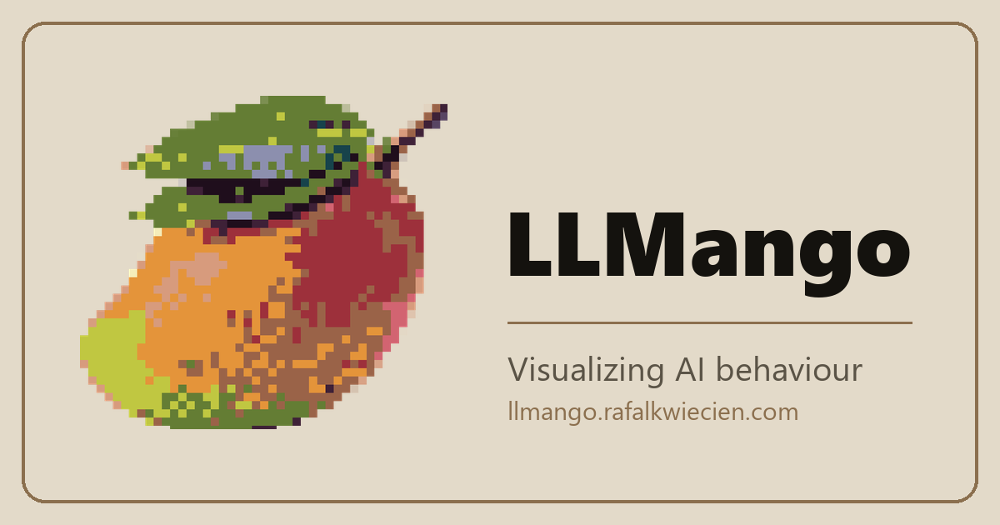
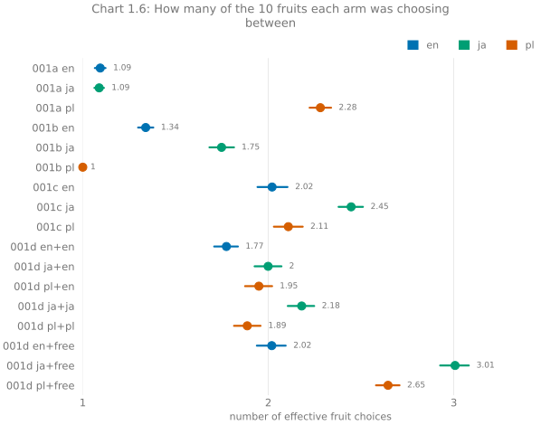

<div align="center">



[WIP - public links not live yet]

[website](https://llmango.rafalkwiecien.com) · [001: fruit](https://llmango.rafalkwiecien.com/e001_fruit) · [dataset](https://huggingface.co/datasets/rafalkwiecien/llmango)

</div>

## Table of contents

- [Background](#background)
- [Main pipeline](#main-pipeline)
- [Experiments](#experiments)
  - [001: Fruit](#001-fruit)
- [What is in this repository](#what-is-in-this-repository)
- [Run it yourself](#run-it-yourself)
- [Layout](#layout)
- [Tech stack](#tech-stack)
- [Maintainers](#maintainers)
- [Contributing](#contributing)
- [Citation](#citation)
- [Licence](#licence)

## Background

This is a blog dedicated to showcasing different behaviours of Large Language Models through prompting them in great volumes and data visualization. LLMango is divided into experiments - each one is different and tries to answer specific questions you might have about LLMs.

## Main pipeline

The project is divided into three levels, starting from the top:

`experiment > question > arm`

An experiment is a bigger topic, which is divided into related, smaller **questions**. They aim to measure the change of one variable, across many **arms**. An **arm** is one setup under a question, like the combination of a prompt in a specific language, prompt input, or an output format, and is sampled thousands of times.

The pipeline is four stages:

```
run  ->  normalize  ->  aggregate  ->  analyze
                    \
                     ->  publish
```

- `run` sends the calls and appends every result as it lands, restating the run manifest before the next call goes out, so an interrupt or a crash costs one call instead of the whole run.
- `normalize` maps every distinct answer onto a canonical category, matching offline first and falling back to an LLM only for what the offline layer cannot resolve, then writes one Parquet file per question. That fallback is a paid call, so it's also possible for `normalize` to cost money.
- `aggregate` owns every number and writes one JSON per question.
- `analyze` draws the SVGs the site embeds, straight from those committed aggregates, which means anyone can redraw every chart in this repository without an API key or a single paid call.
- `publish` is a separate path that uploads the normalized Parquet files and the dataset card to HuggingFace.

## Experiments

### 001: Fruit

<mark>*Can an LLM response change when you prompt it in a different language, or when you present information to the model in a different manner?*</mark>

The experiment is ran with one model, **OpenAI's gpt-5.6-luna**. It's divided into four questions:

| ID | Question |
| --- | --- |
| 001a | When presented with the same set of choices that are in the same order, will an LLM shift its answer, if prompted in a different language? |
| 001b | When presented with a different order of the same set of choices, will an LLM shift its answer? |
| 001c | Across a large sample size, every order of choices presented to the LLM is shuffled. Does the answer get "more random"? |
| 001d | Does requiring structured output in LLMs change their answer? |

Each question is asked in three languages: **English**, **Polish** and **Japanese**. The end result can be summarized with this chart, which showcases how many equally likely options would produce the same spread:



- full write-up: [llmango.rafalkwiecien.com/e001_fruit](https://llmango.rafalkwiecien.com/e001_fruit)
- dataset: [dataset card](https://huggingface.co/datasets/rafalkwiecien/llmango)

## What is in this repository

- `prompts/` - every prompt template, `question.yaml` and input data file
- `data/<experiment>/manifests/` - one manifest per run
- `data/<experiment>/aggregated/` - the numbers every chart reads
- `site/public/charts/` - the drawn SVGs and the `index.json` the pages read

Not committed:

- `data/<experiment>/raw/` - the JSONL each run appends to.
- `data/<experiment>/normalized/` - these live on [HuggingFace](https://huggingface.co/datasets/rafalkwiecien/llmango).
- `.env`, `site/dist/` and `site/node_modules/`

A fresh clone can therefore redraw every chart and serve the site, but it cannot run `aggregate` or `publish`, because both read normalized data. Generate your own with `run` and `normalize`, or pull the published Parquet files down from HuggingFace.

## Run it yourself

You need **Python 3.12+** and [uv](https://docs.astral.sh/uv/). The site additionally needs **Node 22.12+** and **npm 9.6.5+**, as required by Astro 7.1.3.

[just](https://github.com/casey/just) is 100% optional, but I use it as my go-to command runner, so if you wish to use any of my recipes, get it as well.

```sh
git clone https://github.com/kwiecien-rafal/llmango
cd llmango
uv sync --extra dev
cp .env.example .env
```

`.env` holds two keys, at this point I only used OpenAI models, so simply set OPENAI_API_KEY if you wish to make any calls, and HF_TOKEN is used solely for publishing the datasets.

- `OPENAI_API_KEY` for `run` and `normalize`
- `HF_TOKEN` for `publish`

Redrawing the charts and reading the site needs no key and spends nothing:

```sh
just analyze              # every chart, from the committed aggregates
npm --prefix site install # once, before the first run of just site
just site                 # Astro dev server
```

Generating new answers spends money, so start small:

```sh
just all 001a -n 5    # run -> normalize -> aggregate -> analyze, 5 samples per arm
```

A few things worth knowing:

- `run`, `normalize` and `publish` take `--dry-run`, which doesn't need any API key. With this argument passed, `run` prints the plan, the arms it covers and the model's price per million tokens. `normalize` prints how many rows and distinct answers it found, and how many of them would need a paid call. `publish` prints the files it would upload.
- More than **100 paid calls** refuses to start without `--force`. This guards both `run` and `normalize`. `run` also refuses outright, `--force` or not, if the model has no entry in `src/llmango/pricing.json`.
- A rerun **grows** the sample rather than replacing it. `normalize` pools every run of a question and nothing deduplicates.
- `question.yaml` declares the model, the languages, the schemas each language is asked under, and the inputs. Provider and temperature default to `openai` and `1.0` unless the file states otherwise. Nothing on the command line narrows a run to a single arm, so running a subset means editing that file. The model used for normalization is pinned separately, in `src/llmango/config.py`.
- `just check` runs ruff, `ruff format --check`, pyright in strict mode over `src/`, and pytest. The suite is fully offline: no test makes a paid call.

## Layout

```
prompts/<experiment>/<question_id>/    question.yaml + one <lang>.md per language
src/llmango/                           the shared stages, experiment-agnostic
src/llmango/experiments/<experiment>/  experiment.py, charts.py, palette.py
data/<experiment>/                     raw/ + normalized/, manifests/ + aggregated/
site/public/charts/<experiment>/       <chart>.svg, <chart>--narrow.svg, index.json
site/src/pages/<experiment>/index.mdx  that experiment's write-up
tests/                                 one module per source module
```

## Tech stack

- **Pipeline** - Python 3.12, [uv](https://docs.astral.sh/uv/), Typer for the CLI, Pydantic v2 for every structured output, Polars and PyArrow for the normalized Parquet, `huggingface_hub` for publishing.
- **Charts** - matplotlib, written to SVG.
- **Site** - Astro with MDX.
- **Quality** - ruff, pyright in strict mode over `src/`, pytest, and `just` as a command runner.

## Maintainers

[Rafał Kwiecień](https://github.com/kwiecien-rafal)

## Contributing

Issues and pull requests are welcome. Open an issue to ask a question or propose a change before sending a large PR. Run `just check` before opening one.

## Licence

Code is **MIT**, see [LICENSE](LICENSE).

The dataset on HuggingFace is **CC BY 4.0**, attribution to Rafał Kwiecień.
